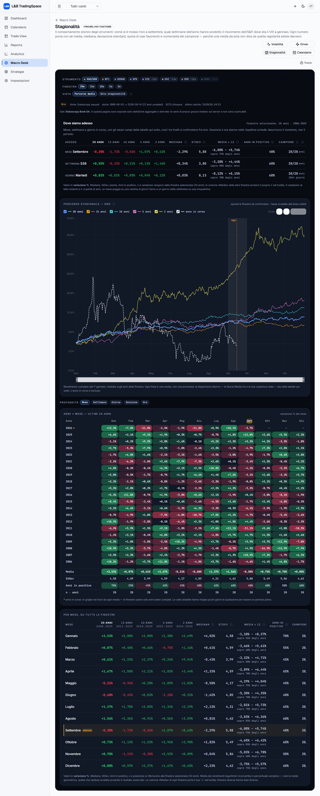
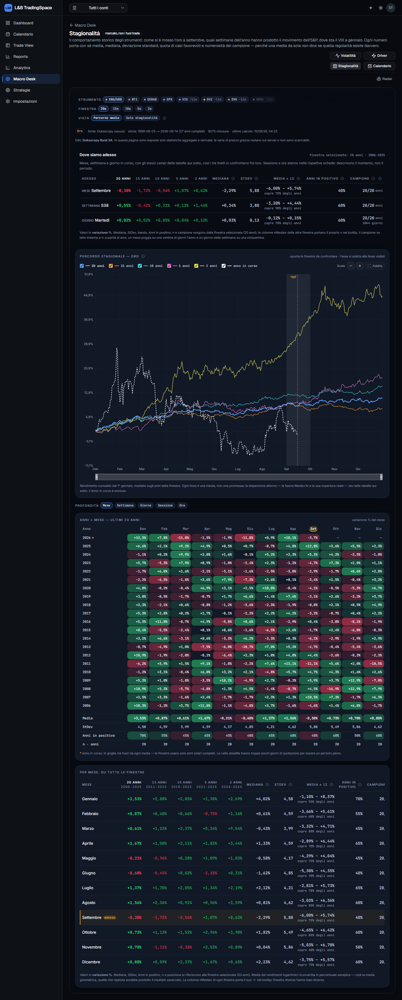
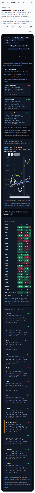
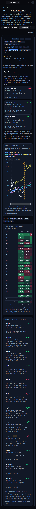

# Stagionalità — stato precedente al rifacimento

Fotografia del 15/09/2026, prima di qualunque modifica. Serve a due cose: poter
tornare indietro e confrontare i numeri dopo.

- **Codice:** tag git `stagionalita-pre-rifacimento` → commit `40934a0` di `main`.
  Per tornare indietro: `git checkout stagionalita-pre-rifacimento -- src/lib/seasonality src/components/seasonality "src/app/(app)/macro-desk/stagionalita"`.
- **Dati:** gli stessi di produzione dopo il job delle 04:21 UTC del 15/09/2026
  (copiati in locale in sola lettura per le schermate). I punti delle curve
  salvati in quel momento, per strumento e finestra, sono in
  [`stagionalita/stato-precedente/curve.json`](stagionalita/stato-precedente/curve.json).

## 1. Quali dati legge la pagina

La pagina (`src/app/(app)/macro-desk/stagionalita/page.tsx`) **non calcola
niente**: legge solo righe precalcolate dal job notturno
(`src/lib/seasonality/job.ts`, rotta `/api/seasonality-sync`) tramite
`src/lib/seasonality/query.ts`.

| Tabella | Cosa contiene | Chi la usa in pagina |
|---|---|---|
| `SeasonalityCoverage` | fonte, primo/ultimo giorno, righe, anni completi, note | testata dei dati, avvisi di finestra troncata |
| `SeasonalityRun` | ultima esecuzione del job | «ultimo calcolo» |
| `SeasonalityPathPoint` | un punto per (strumento, finestra, grezzo/detrend, giorno dell'anno 1-366): `meanCum`, `medianCum`, `p25Cum`, `p75Cum`, `positiveShare`, `n` | grafico «Percorso stagionale» (usa **solo** `meanCum`) |
| `SeasonalityStat` | statistiche per bucket (mese, settimana ISO, giorno lun-ven, sessione, ora) × finestra × scope × detrend: n, media, mediana, σ, quota positiva, p25/p75, copertura ±1σ | riepilogo «Dove siamo adesso», righe di sintesi della heatmap, tabella «Per mese, su tutte le finestre» |
| `SeasonalityYearBucketObs` | un valore per (anno, bucket) | heatmap anni × bucket |
| `SeasonalityQuarterYear` | media annua di ogni quarto d'ora (M15) | grafico «Ritorno intraday cumulato» (solo scheda Ora) |

Le barre grezze (`SeasonalityDailyBar`, `SeasonalityHourBar`) restano sul
server: la pagina non le legge mai.

### Archivio al 15/09/2026 (produzione)

| Strumento | Tipo | Giornaliero | Anni solari completi | Massimo/minimo della barra | Intraday |
|---|---|---|---|---|---|
| Oro XAU/USD | prezzo | Dukascopy, 03/06/1999 → | 26 (2000-2025) | sì, completi dal 2003 (2000-2002 parziali) · **~52 barre di domenica l'anno** | H1 dal 2003 |
| Petrolio WTI | prezzo | FRED spot Cushing, 02/01/1986 → | 40 | **no** (FRED pubblica solo la chiusura) | H1 dal 2011 (CFD) |
| GER40 (DAX) | prezzo | Yahoo ^GDAXI, 30/12/1987 → | 38 | sì | H1 dal 2013 (CFD) |
| S&P 500 | prezzo | Yahoo ^GSPC, 02/01/1970 → | 56 | sì | H1 dal 2011 (CFD) |
| VIX | livello | CBOE, 02/01/1990 → | 36 | sì (qualche seduta 1992-1999 senza) | — |
| GVZ | livello | CBOE + FRED, 03/06/2008 → | 17 (2009-2025) | no | — |
| OVX | livello | CBOE + FRED, 10/05/2007 → | 18 (2008-2025) | no | — |
| VDAX | livello | nessuna fonte | 0 | — | — |

Granularità del giornaliero: una barra per seduta. Nessun mese mancante negli
anni completi.

## 2. Con quale formula costruisce le curve

### Strumenti di prezzo (oro, WTI, DAX, S&P)

1. **Prezzi → rendimenti log giornalieri**: `series.ts:147-156`
   (`dailyLogReturns`, `ln(P_t / P_{t-1})` su barre consecutive).
2. **Rendimenti → percorso cumulato per anno**: `series.ts:346-377`
   (`cumulativePathsByYear`): per ogni anno, somma dei rendimenti dal 1° gennaio,
   indicizzata sul giorno dell'anno di calendario (1-366); nei giorni senza
   quotazione si riporta il valore precedente.
3. **Media fra gli anni della finestra**: `precompute.ts:607-611` sceglie i
   percorsi, `precompute.ts:401-420` (`pathRows`) calcola per ogni giorno media,
   mediana, p25 e p75 dei cumulati degli anni.
4. **Display in percentuale**: `page.tsx:365-371` converte `(e^meanCum − 1)·100`;
   l'asse è in `%` (`path-chart.tsx:237-239`).

È la pipeline *prezzi → rendimenti → cumulata*, **non** la media dei prezzi.
L'ordine è «cumula per anno, poi media»: con lo stesso insieme di anni su ogni
giorno è identico a «media dei rendimenti per giorno, poi cumula» (la verifica
numerica è nella fase 2).

### Indici di volatilità (VIX, GVZ, OVX)

`series.ts:384-412` (`levelPathsByYear`): il **livello** di chiusura per giorno
dell'anno (riportato nei giorni chiusi), poi `pathRows` ne fa la media fra gli
anni. Non si calcola alcun rendimento: la curva è la **media dei livelli**. Era
una scelta dichiarata («un livello non compone», `metric-info.ts:112-118`).

### Vista «Solo stagionalità» (detrend)

`precompute.ts:432-455`: toglie a ogni anno la deriva media giornaliera × giorno
trascorso. Solo per gli strumenti di prezzo.

## 3. Finestre offerte

`instruments.ts:315`: **20, 15, 10, 5, 2 anni solari completi** (default 20),
l'anno in corso escluso dalle medie (`precompute.ts:6-24`). Tutte le finestre
restano selezionabili anche quando la storia non basta: la finestra viene
marcata con «!» e un avviso «storia disponibile N anni» (GVZ e OVX a 20 anni).
Sulle schede intraday le finestre più lunghe dell'archivio orario vengono
nascoste (`query.ts:348-357`).

In più: anno in corso sovrapposto (lookback 0), orologio Roma/UTC sulla scheda
Ora, filtro «dentro il mese» sulla scheda Giorno.

## 4. Cosa mostra a schermo

Dall'alto (1440px, 3.574px di pagina; 390px, 5.349px):

1. Testata vecchia: link «← Macro Desk», titolo con badge, descrizione lunga,
   griglia di pillole delle sezioni con il Radar sotto un filo.
2. Blocco `.macro-report` **scuro fisso anche in tema chiaro**, font Inter e
   JetBrains Mono.
3. Selettori a chip propri (`controls.tsx`): strumento, finestra, vista.
4. Fonte, storia, conteggio chiusure, ultimo calcolo, attribuzione.
5. «Dove siamo adesso»: mese, settimana e giorno correnti con media per
   finestra, mediana, σ, media ±1σ con copertura, anni in positivo (in %),
   campione.
6. «Percorso stagionale»: una linea per finestra in **rendimento cumulato %**,
   anno in corso tratteggiato, linea «oggi», fascia del mese corrente, zoom. **Nessuna banda di dispersione** (p25/p75 esistono nel database ma non
   sono disegnati), nessuna lisciatura.
7. Schede di profondità a chip: Mese, Settimana, Giorno, Sessione, Ora.
8. Heatmap anni × bucket con righe di sintesi Media, StDev, Anni in positivo
   (in %), n.
9. Tabella «Per mese, su tutte le finestre»: media per ogni finestra, mediana,
   σ, media ±1σ, anni in positivo (in %), campione, posizione.

Assenti: migliore e peggiore anno, MAE/MFE di periodo, frequenze come conteggio.

### Misure nel DOM (build locale, 15/09/2026)

| | 1440 chiaro | 1440 scuro | 390 chiaro | 390 scuro |
|---|---|---|---|---|
| Altezza pagina | 3.574 | 3.574 | 5.349 | 5.349 |
| Famiglie di carattere | Geist, Inter, JetBrains Mono | idem | idem | idem |
| Testi < 11px | 0 | 0 | 0 | 0 |
| Testi < 4,5:1 | 1 («Scala», 3,41) | 0 | 1 («Scala», 3,41) | 0 |
| Tabelle che scorrono | «Per mese» +170px | idem | heatmap +638px, riepilogo +59px | idem |

Punti di formattazione numerica fatti a mano (`toFixed`/`toLocaleString`): 13
contati dal grep (l'incarico ne indicava 12), in `format.ts:65,72,92`, `bucket-window-table.tsx:182,431`,
`riepilogo-adesso.tsx:153,343`, `path-chart.tsx:238,325`,
`hour-path-chart.tsx:207,269`, `page.tsx:366,597`.

## 5. Schermate

| | Chiaro | Scuro |
|---|---|---|
| 1440 |  |  |
| 390 |  |  |
